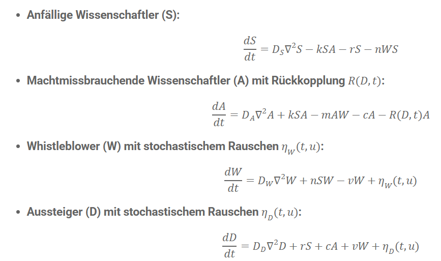

# Systemdynamik des Machtmissbrauchs in der Wissenschaft – Ein mathematisches Modell
                           
Wie breitet sich Machtmissbrauch in der Wissenschaft aus? Welche Rolle spielen Whistleblower, Reformen oder das stille Verschwinden idealistischer Forschender?
Diese Fragen treiben viele in der Wissenschaft um – doch was, wenn wir solche Dynamiken mathematisch modellieren könnten?

Ich stelle hier ein Reaktions-Diffusions-Modell vor, das genau diese Prozesse beschreibt – basierend auf partiellen Differentialgleichungen (PDEs) und simuliert mit ein paar Zeilen Code in Python.

Das Modell: Vier Gruppen – eine Dynamik
Das Modell unterscheidet vier Gruppen von Wissenschaftler:innen:

S(t, u) – Anfällige Personen, die durch strukturelle oder soziale Bedingungen gefährdet sind.
A(t, u) – Personen, die aktiv Macht missbrauchen.
W(t, u) – Whistleblower, die Missstände aufdecken.
D(t, u) – Personen, die resignieren und das System verlassen.
Dabei stellen die Variablen t Zeit und u räumliche Dimensionen (x, y) dar. Man könnte allerdings auch weitere Einfluss Faktoren bzw. Dimensionen heranziehen, wie z. B. Integrität,  Erfolg in der Karriere oder Narzissmus, Machiavellismus oder Psychopathie Anteile der Persönlichkeit.

Diese Gruppen sind über Reaktions- und Diffusionstermen miteinander verknüpft – analog zu Modellen in der Ökologie oder Epidemiologie.

Ein Auszug der zentralen Gleichungen:
Hier sind die Hauptgleichungen des mathematischen Modells:

Die Begriffe wie
DD∇2 stehen dabei für die räumliche Diffusion – also die Verbreitung von Verhalten oder Einfluss.
Stochastisches Rauschen (Skandale, Zufallsereignisse) z. B. η(t,u) und  ξ(t,u), ist ebenfalls Teil des Modells.

Reformen als Gegenkraft

Ein Reformterm R(D,u) modelliert strukturelle Gegenmaßnahmen – z. B. Transparenzrichtlinien, Schutzsysteme für Whistleblower oder Kulturwandel. Ab einem bestimmten Zeitpunkt setzt der Reformdruck ein und reduziert schrittweise den Einfluss der Missbrauchenden. Dies bewirkt, dass Reformen den Machtmissbrauch bremsen, besonders wenn viele Wissenschaftler aussteigen oder das System sich wandelt.

Was bringt so ein Modell?
Systemische Sichtweise: Wir können Wechselwirkungen sichtbar machen, z. B. wie Aussteiger und Missbrauchende das System weiter schwächen.
Szenarien simulieren: Was passiert ohne Reformen? Oder mit stärkerem Whistleblower-Schutz?
Diskussion anregen: Dieses Modell ist ein Werkzeug zur Reflexion – kein Dogma, sondern ein Denkansatz.
Code & Simulation verfügbar

Ich habe das Modell in Python umgesetzt. Die Simulation ist offen zugänglich: 

**[SAWD Simulation Notebook](SAWD_PDEs.ipynb)**

Erweiterungsmöglichkeiten
Das Ganze lässt sich noch weiter ausbauen, indem Animationen mit interaktiven UI-Elementen kombiniert werden. Dadurch können Parameter variiert werden, um zu beobachten, wie empfindlich das System auf Änderungen reagiert und wann stabile Zustände erreicht werden. Darüber hinaus wäre es möglich, agentenbasierte Modelle in Verbindung mit Reinforcement Learning zu nutzen, um zu zeigen, wie Agenten ihr Verhalten durch systemische Bedingungen anpassen, um erfolgreich zu agieren. Während PDEs systemische Trends zeigen, könnten agentenbasierte Modelle z.B. Mikroentscheidungen einzelner Akteure besser erfassen. Eine Kombination wäre sicherlich spannend! 

In diesem Zusammenhang habe ich mit der Python-Bibliothek agentpy [0] eine erste Simulation implementiert, die ich im Laufe der Zeit mit Reinforcement Learning-Agenten erweitern möchte.

[0] https://agentpy.readthedocs.io/en/latest/ 
